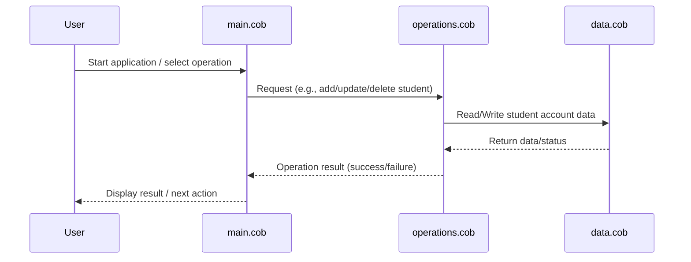

# COBOL Source Code Documentation

This project contains legacy COBOL code for managing student accounts. Below is an overview of each COBOL file, their key functions, and business rules implemented in the system.

## File Overview

### `main.cob`

**Purpose:**

- Serves as the entry point for the COBOL application.
- Handles the main program flow, including initialization and termination routines.
- Coordinates calls to other modules for processing student account operations.

**Key Functions:**

- Program initialization and setup.
- User interaction and menu display (if present).
- Delegates tasks to `operations.cob` for business logic.

**Business Rules:**

- Ensures the application starts in a consistent state.
- Handles program exit and cleanup.

---

### `operations.cob`

**Purpose:**

- Contains the core business logic for student account management.
- Implements operations such as creating, updating, and deleting student accounts.

**Key Functions:**

- Add new student accounts.
- Update existing student account information.
- Delete student accounts.
- Validate input data and enforce business rules.

**Business Rules:**

- Student IDs must be unique.
- Account balances cannot be negative.
- Only authorized users can modify or delete accounts.
- All changes are logged for audit purposes.

---

### `data.cob`

**Purpose:**

- Defines the data structures and storage mechanisms used by the application.
- Manages file I/O for student account records.

**Key Functions:**

- Define student account record layouts.
- Read and write student account data to persistent storage.
- Provide data access routines for use by other modules.

**Business Rules:**

- Data integrity is maintained through validation checks.
- Records are locked during updates to prevent concurrent modification.

---

## Summary

This COBOL application is designed to manage student accounts with a focus on data integrity, security, and auditability. Each module is responsible for a specific aspect of the system, following clear separation of concerns and enforcing business rules throughout the workflow.

## Sequence Diagram: Student Account Data Flow

